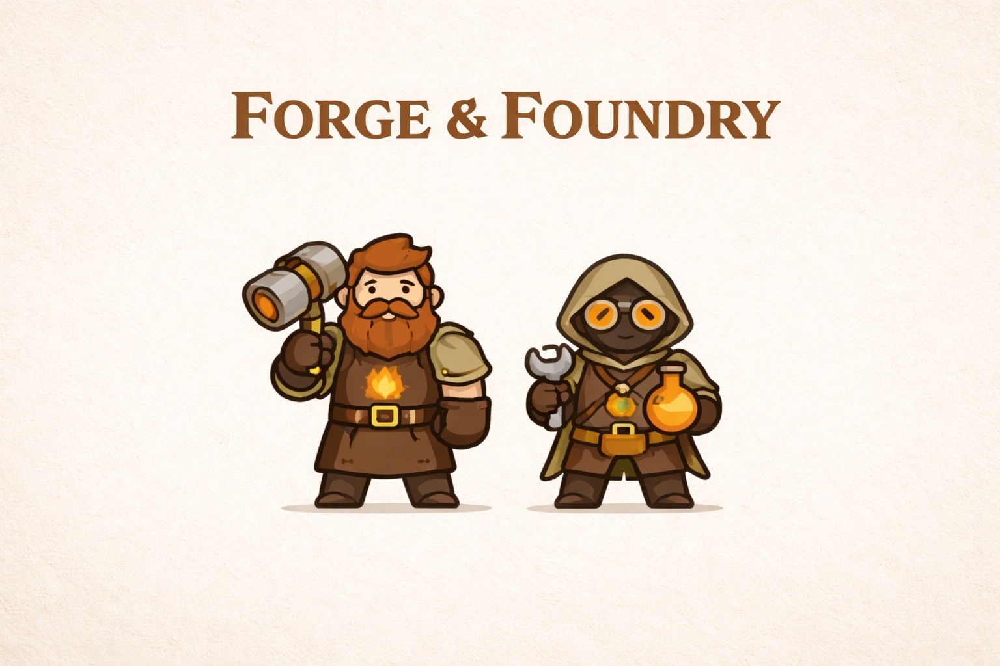
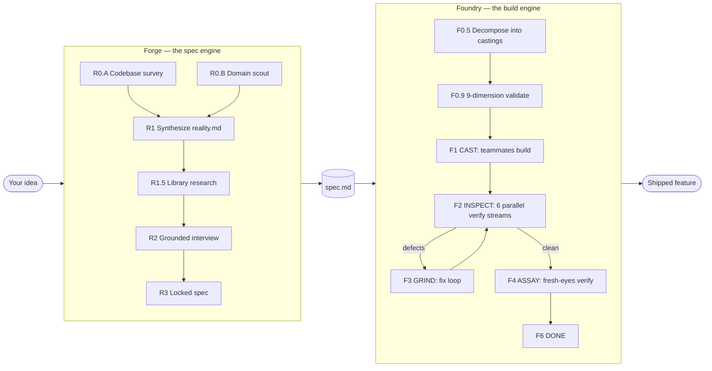

<p align="center">
  
</p>

<p align="center">
  <b>Forge plans. Foundry builds.</b><br/>
  <i>A dynamic-duo plugin marketplace for Claude Code — the spec engine and the build engine, working as one.</i>
</p>

<p align="center">
  
  
  
  
</p>

---

## Why Codsworth

Most AI coding tools either **ask and build in one breath** (producing code that diverges from what you actually wanted) or **plan in one context and execute in another** (producing plans that rot on the way to the executor).

Codsworth splits the work cleanly across two specialised plugins and makes them honest partners:

- **Forge** runs a codebase-aware, ecosystem-grounded **interview** and produces a locked, verifiable `spec.md`.
- **Foundry** takes the locked spec and runs an **autonomous build-verify-fix loop** with mechanical drift prevention at every handoff.

The two plugins share a common discipline: **plans are prompts**. What Forge writes is what Foundry reads, byte for byte. No interpretation layer, no paraphrasing, no "I'll just adjust the scope a little." The spec survives the trip.

---

## The dynamic duo



Each plugin has one job and does it well. Forge does not build. Foundry does not interview. They talk through a single shared artifact — the spec — and every mechanism in the marketplace exists to keep that artifact intact across the handoff.

---

## Quick start

```bash
# In Claude Code: add the marketplace and install the duo
claude plugin marketplace add AlphaBravoCompany/codsworth-marketplace
claude plugin install forge@codsworth
claude plugin install foundry@codsworth

# Wire Foundry's MCP server into your target project
claude mcp add foundry -- uvx --from "git+https://github.com/AlphaBravoCompany/codsworth-marketplace#subdirectory=plugins/foundry/mcp-server" foundry-mcp --project-root .
```

Then, from inside your project:

```bash
# Step 1 — Forge interviews you and produces a spec
/forge:plan "add a workloads page that lists running pods with status and logs"

# ... Forge runs 5 parallel research agents (4 codebase + 1 domain scout),
#     then walks you through a grounded interview, then writes spec.md ...

# Step 2 — Foundry takes the spec and builds it
/foundry:start pioneer --spec docs/specs/workloads-page.md
```

From `/foundry:start` onward, Foundry runs fully autonomous until it's done. No approval gates, no checkpoints, no "is this what you wanted?" It builds, it verifies, it grinds defects until they're gone, then it assays the final result against the spec one more time.

---

## Forge — the spec engine

Forge conducts a **codebase-aware specification interview** and produces a foundry-ready spec with every requirement tagged, classified, and locked.

### What makes Forge different

- **Dual-track R0 research** (v3.2.0). Forge spawns **5 parallel agents** before it asks a single question: 4 Explore agents survey your codebase (architecture, data, surface, infra) and 1 `domain-scout` agent runs an ecosystem scan on the feature category — prior art, common gotchas, questions you probably haven't thought about. The interviewer walks in with both inside-in and outside-in context.
- **Library-version research** at R1.5 kills stale-knowledge questions ("is htmx 2.x still current? did client-go's Deployments API change?"). The interviewer never asks something it could have verified.
- **Spec type detection** — every feature is classified as `GREENFIELD`, `MIGRATION`, `BUG_FIX`, or `REFACTOR`. Migration specs get enforced source-inventory enumeration: every symbol to port must be named explicitly, no wiggle-word "equivalent coverage" allowed.
- **Requirement classification** — every item is tagged `Locked` (implement exactly), `Flexible` (teammate discretion), or `Informational` (context only). Foundry teammates honour the classification mechanically.
- **AskUserQuestion-driven interview** — no text parsing, no ambiguous free-form prompts. Questions are structured, answers are structured.

### Forge phases

| Phase | What it does |
|---|---|
| R0 SURVEY + DOMAIN | 4 codebase Explore agents + 1 domain scout, all parallel |
| R1 SYNTHESIZE | Merges all 5 agent outputs into `reality.md` |
| R1.5 RESEARCH | Targeted web research to verify stale library assumptions |
| R2 INTERVIEW | Multi-round grounded interview with spec-type detection |
| R3 SPEC | Writes the final `spec.md` with locked/flexible/informational classification |
| R4 VALIDATE | Verifies file references, pattern references, coverage |

---

## Foundry — the build engine

Foundry takes a spec and **autonomously** delivers a working feature, with mechanical verification and drift prevention at every layer.

### What makes Foundry different

- **"Plans are prompts" architecture (v3.0.0).** Decompose authors every teammate prompt once at F0.5, saves it to disk, validates it against the master spec character-for-character, and freezes it. The lead at F1/F3 is a router, not an interpreter — it never re-drafts, paraphrases, or edits teammate prompts. One source of truth, verified mechanically, handed off verbatim.
- **Drift-prevention triad (v3.3.0).** Every casting prompt carries three frozen source-of-truth blocks, byte-identical across every teammate:
  - `<spec_requirements>` — the casting's spec slice
  - `<global_invariants>` — cross-cutting spec rules (auth, validation, security)
  - `<mandatory_rules>` — full CLAUDE.md / AGENTS.md / .cursorrules imperatives, extracted by the codebase mapper
- **9-dimension F0.9 validation.** A mechanical quality gate that runs before any code is written:
  1. Requirement coverage
  2. Casting completeness
  3. Dependency correctness (no file overlap)
  4. Key links planned (artifacts wired)
  5. Scope sanity
  6. Research integration
  7. Prompt fidelity (7e: global_invariants propagation · 7g: mandatory_rules propagation)
  8. Migration coverage (MIGRATION specs only — 1:1 source inventory)
  9. Spec structure (requirement IDs, global invariants section)
- **6-stream F2 INSPECT verification.** After teammates build, Foundry runs up to six parallel verification streams:
  - **TRACE** — LSP-powered wiring verification via Serena (three-level: EXISTS → SUBSTANTIVE → WIRED)
  - **PROVE** — Spec-to-code citation verification with stub detection
  - **RESEARCH_AUDIT** — Checks code honours every research recommendation
  - **COVERAGE_DIFF** — 1:1 symbol check for MIGRATION specs
  - **SIGHT** — Browser-based UI audit via Playwright
  - **TEST / PROBE** — Full test suite + API smoke
- **F3 GRIND loop.** Every defect becomes a task attached to the casting it belongs to. Teammates fix, Foundry re-verifies. No partial fixes, no deferred work.
- **F4 ASSAY.** After INSPECT is clean, four fresh-eyes agents re-read the spec, form expectations, *then* read the code. Catches stubs and hollow handlers that passed earlier checks.
- **Requirement-ID citation enforcement.** Before a casting is accepted, the teammate's completion report must cite a `file:line` proof for every requirement ID in its spec slice. Missing citations = rejected, re-dispatched.
- **Stall watchdog.** The orchestrator tracks time between calls. If the lead sits silent for more than 3 minutes, the next call returns a visible `⚠ STALL DETECTED` warning that forces explicit re-engagement.

### Foundry phases

| Phase | What it does |
|---|---|
| F0 RESEARCH | Per-domain researcher agents + optional codebase mapping |
| F0.5 DECOMPOSE | Authors castings + verbatim teammate prompts |
| F0.9 VALIDATE | 9-dimension mechanical gate before building |
| F1 CAST | Parallel wave-based building via teammates |
| F2 INSPECT | Up to 6 parallel verification streams |
| F3 GRIND | Fix defects, re-inspect, repeat until clean |
| F4 ASSAY | Fresh-eyes final verification with stub detection |
| F5 TEMPER | Optional — micro-domain stress testing (`--temper`) |
| F5.5 NYQUIST | Optional — regression test generation (`--nyquist`) |
| F6 DONE | Shutdown, report, commit |

---

## What makes the duo different

| Most AI coding tools | Codsworth |
|---|---|
| Ask and build in one breath | Interview → spec → autonomous build, cleanly separated |
| Planner rewrites the prompt for the executor | Plans are prompts — decompose authors once, verbatim everywhere |
| Drift prevention is prose discipline | Drift prevention is mechanical (F0.9 + Accept-Casting + byte-identical propagation) |
| "Looks done" = tests pass | "Looks done" = 9 validation dimensions + 6 inspect streams + fresh-eyes assay |
| User approves every phase | Fully autonomous from `/foundry:start` to F6 DONE |
| CLAUDE.md is loaded per agent and hoped-for | CLAUDE.md rules are extracted verbatim and propagated byte-identical into every casting, verified mechanically |
| Research happens after decisions are made | R0.B DOMAIN + R1.5 RESEARCH both run **before** the interview, grounding every question |
| Bugs are logged for later | Every defect becomes a casting-scoped grind task; no deferrals |

---

## Under the hood

Foundry's orchestration state lives in an MCP server written in Python, which the `foundry` Lead inside Claude Code calls at every phase transition via tools like `Foundry-Next`, `Foundry-Validate-Castings`, `Foundry-Spawn-Teammate`, `Foundry-Accept-Casting`, and `Foundry-Handoff`. Every casting prompt, every acceptance check, every handoff event is recorded in `foundry-archive/{run}/` under the target project — a full audit trail for every build.

Forge writes specs under `docs/specs/{feature-slug}/spec.md` using a structured template with frontmatter, tagged requirement IDs (`US-N`, `FR-N`, `NFR-N`, `AC-N`), and requirement classification. Foundry's F0.5 DECOMPOSE reads the spec as its sole source of truth — it does not read `docs/specs/*.json` or any intermediate Forge state.

---

## Update

```bash
claude plugin marketplace update codsworth
claude plugin update forge@codsworth
claude plugin update foundry@codsworth
```

## Versioning

See [GitHub releases](https://github.com/AlphaBravoCompany/codsworth-marketplace/releases) for the full changelog. Current:

- **Forge v3.2.0** — adds R0.B DOMAIN research track alongside R0.A SURVEY; dual-track pre-interview research.
- **Foundry v3.3.3** — drift-prevention triad, stall watchdog, slim lead (rules moved to `references/lead-discipline.md`), checkpoint content stripped, display regression + CAST spawn imperative fixes.

## Contributing

Issues and pull requests welcome at [github.com/AlphaBravoCompany/codsworth-marketplace](https://github.com/AlphaBravoCompany/codsworth-marketplace). If you're adding a new validation dimension, drift-prevention mechanism, or inspect stream, open a discussion first — the "plans are prompts" architecture is load-bearing and worth preserving.

## License

MIT — see [LICENSE](./LICENSE).

---

<p align="center"><i>Forge plans. Foundry builds. You ship.</i></p>
