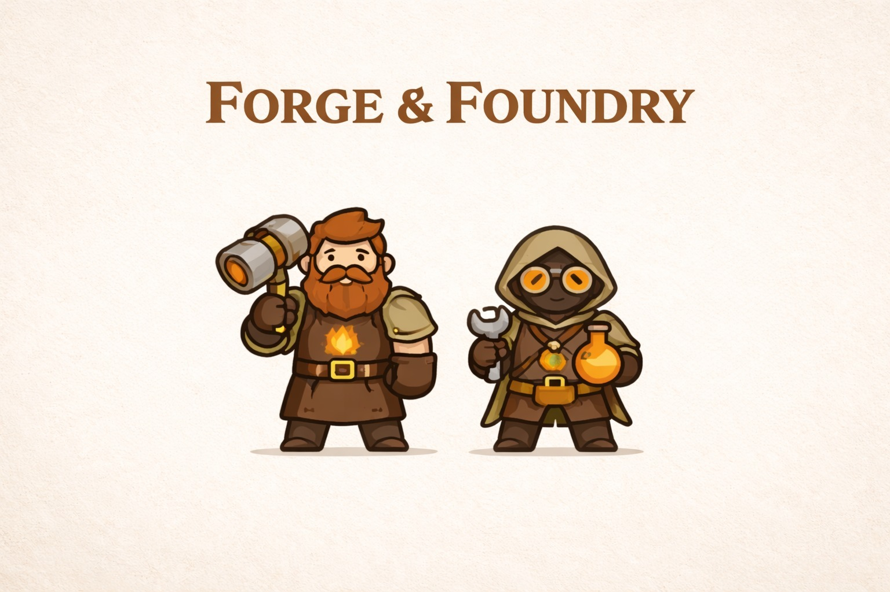
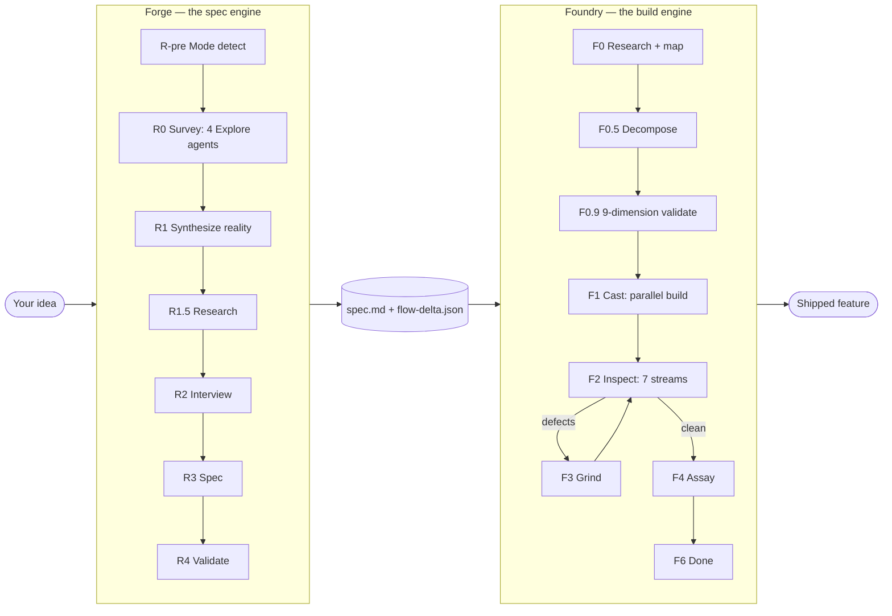

<p align="center">
  
</p>

<p align="center">
  <b>Forge plans. Foundry builds.</b><br/>
  <i>A two-plugin marketplace for Claude Code — the spec engine and the build engine, working as one.</i>
</p>

<p align="center">
  
  
  
  
</p>

---

## Why Codsworth

Most AI coding tools either **ask and build in one breath** — producing code that drifts from what you actually wanted — or **plan in one context and execute in another**, producing plans that rot on the way to the executor.

Codsworth splits the work cleanly across two specialised plugins and makes them honest partners:

- **Forge** runs a codebase-aware, ecosystem-grounded **interview** and produces a locked, verifiable spec.
- **Foundry** takes the locked spec and runs an **autonomous build-verify-fix loop** with mechanical drift prevention at every handoff.

Both plugins share one discipline: **plans are prompts**. What Forge writes is what Foundry reads, byte for byte. No interpretation layer, no paraphrasing, no "I'll just adjust the scope a little." The spec survives the trip.

---

## The duo


```mermaid
flowchart LR
    idea([Your idea]) --> forge
    subgraph forge[Forge — the spec engine]
        direction TB
        Rpre[R-pre Mode detect] --> R0
        R0[R0 Survey: 4 Explore agents] --> R1
        R1[R1 Synthesize reality] --> R15[R1.5 Research]
        R15 --> R2[R2 Interview]
        R2 --> R3[R3 Spec]
        R3 --> R4[R4 Validate]
    end
    forge --> spec[(spec.md + flow-delta.json)]
    spec --> foundry
    subgraph foundry[Foundry — the build engine]
        direction TB
        F0[F0 Research + map] --> F05[F0.5 Decompose]
        F05 --> F09[F0.9 9-dimension validate]
        F09 --> F1[F1 Cast: parallel build]
        F1 --> F2[F2 Inspect: 7 streams]
        F2 -->|defects| F3[F3 Grind]
        F3 --> F2
        F2 -->|clean| F4[F4 Assay]
        F4 --> F6[F6 Done]
    end
    foundry --> shipped([Shipped feature])
```

Each plugin has one job and does it well. Forge does not build. Foundry does not interview. They communicate through a single shared artifact — the spec — and every mechanism in the marketplace exists to keep that artifact intact across the handoff.

---

## Quick start

```bash
# In Claude Code: add the marketplace and install the duo
claude plugin marketplace add AlphaBravoCompany/codsworth-marketplace
claude plugin install forge@codsworth
claude plugin install foundry@codsworth

# Wire Foundry's MCP server into your target project
claude mcp add foundry -- uvx --from "git+https://github.com/AlphaBravoCompany/codsworth-marketplace#subdirectory=plugins/foundry/mcp-server" foundry-mcp --project-root .
```

Then, from inside your project:

```bash
# Step 1 — Forge interviews you and produces a spec
/forge:plan "add a workloads page that lists running pods with status and logs"

# ... Forge runs codebase research in parallel, then walks you through a
#     grounded interview, then writes spec.md (and flow-delta.json on
#     brownfield runs) ...

# Step 2 — Foundry takes the spec and builds it
/foundry:start pioneer --spec docs/specs/workloads-page.md
```

From `/foundry:start` onward, Foundry runs fully autonomous until it's done. No approval gates, no checkpoints, no "is this what you wanted?" It builds, verifies, grinds defects until they're gone, then assays the final result against the spec one more time.

---

## Forge — the spec engine

Forge conducts a **codebase-aware specification interview** and produces a foundry-ready spec with every requirement tagged, classified, and locked.

### What makes Forge different

- **Mode detection.** Every run is classified as `brownfield`, `greenfield`, or `cosmetic`. Brownfield runs produce a flow delta against the existing system. Greenfield runs produce an end-state spec. Cosmetic runs skip flow mapping entirely.
- **Parallel codebase research.** Before asking a single question, Forge spawns 4 Explore agents to survey your codebase (architecture, data, surface, infra) in parallel. The interviewer walks in already grounded.
- **R1.5 ecosystem research.** Targeted research into library versions, API shapes, and common gotchas for the feature category — so the interviewer never asks something it could have verified.
- **Brownfield flow grounding.** A `flow-mapper` agent produces a real, LSP-anchored graph of the existing system. The R2 interviewer walks the user through node-by-node hop confirmation, with the entrypoint user-confirmed before any hops are sketched. The output is a `flow-delta.json` of grounded hops, not a free-form end-state description.
- **Spec type classification.** Every feature is tagged `GREENFIELD`, `MIGRATION`, `BUG_FIX`, or `REFACTOR`. Migration specs get enforced source-inventory enumeration: every symbol to port must be named explicitly, no wiggle-word "equivalent coverage" allowed.
- **Requirement classification.** Every item is tagged `Locked` (implement exactly), `Flexible` (teammate discretion), or `Informational` (context only). Foundry teammates honour the classification mechanically.
- **Verbatim-fidelity gate.** Locked requirements must quote the user verbatim with a transcript citation. The deterministic `validate-spec.py` gate refuses to finalize a spec until every Locked item is byte-identical to the source answer.
- **AskUserQuestion-driven interview.** Structured questions, structured answers — no free-form prompt parsing.

### Forge phases

| Phase | What it does |
|---|---|
| R-pre MODE DETECT | Classifies the run as `brownfield` / `greenfield` / `cosmetic` and confirms with the user |
| R0 SURVEY | 4 Explore agents map architecture, data, surface, and infra in parallel |
| R1 SYNTHESIZE | Merges survey outputs into `reality.md` |
| R1.5 RESEARCH | Targeted online research grounded in survey findings (library versions, ecosystem shapes) |
| R2 INTERVIEW | Adaptive interview; brownfield mode adds flow-graph + node-by-node hop confirmation |
| R3 SPEC | Writes the final `spec.md` (plus `flow-delta.json` on brownfield runs) |
| R4 VALIDATE | Verifies file references, citations, coverage, and verbatim fidelity |

---

## Foundry — the build engine

Foundry takes a spec and **autonomously** delivers a working feature, with mechanical verification and drift prevention at every layer.

### What makes Foundry different

- **"Plans are prompts" architecture.** Decompose authors every teammate prompt once at F0.5, saves it to disk, validates it against the master spec, and freezes it. The lead at F1/F3 is a router, not an interpreter — it never re-drafts, paraphrases, or edits teammate prompts. One source of truth, verified mechanically, handed off verbatim.
- **Drift-prevention triad.** Every casting prompt carries three frozen source-of-truth blocks, byte-identical across every teammate:
  - `<mandatory_rules>` — full CLAUDE.md / AGENTS.md / .cursorrules imperatives, extracted by the codebase mapper
  - `<global_invariants>` — cross-cutting spec rules (auth, validation, security, architectural placement)
  - `<spec_requirements>` — the casting's specific spec slice
- **Brownfield packet-mode prompts.** When the spec carries a flow delta, teammates receive `<upstream_anchor>`, `<prerequisite_hops>`, `<this_hop>`, `<downstream_contract>`, and `<self_check>` blocks instead of an end-state description. There is no end-state to anchor backward from — the failure mode V3 is engineered to prevent.
- **9-dimension F0.9 validation.** A mechanical quality gate that runs before any code is written: requirement coverage, casting completeness, dependency correctness (no file overlap), key links planned, scope sanity, research integration, prompt fidelity (with `<global_invariants>` and `<mandatory_rules>` propagation sub-checks), migration coverage, spec structure, and File-Change-Map ↔ key_files cross-check.
- **F2 INSPECT — up to 7 verification streams.** After teammates build, Foundry runs in parallel:
  - **TRACE** — LSP-powered upstream wiring (EXISTS → SUBSTANTIVE → WIRED → PLACED)
  - **FLOW_TRACE** — brownfield only; downstream wiring (PRODUCED → CONSUMES_UPSTREAM → SUBSTANTIVE → CHAIN_INTACT)
  - **PROVE** — spec-to-code citation verification with stub detection
  - **RESEARCH_AUDIT** — checks code honours every research recommendation
  - **COVERAGE_DIFF** — 1:1 symbol check for MIGRATION specs
  - **SIGHT** — browser-based UI audit via Playwright
  - **TEST / PROBE** — full test suite + API smoke
- **F3 GRIND loop.** Every defect becomes a task attached to the casting it belongs to. Teammates fix, Foundry re-verifies. No partial fixes, no deferred work.
- **F4 ASSAY.** After INSPECT is clean, four fresh-eyes agents re-read the spec, form expectations, *then* read the code. Catches stubs and hollow handlers that passed earlier checks.
- **Requirement-ID citation enforcement.** Before a casting is accepted, the teammate's completion report must cite a `file:line` proof for every requirement ID in its spec slice. Missing citations = rejected, re-dispatched.
- **Methodical teammate.** Teammates are tuned for correctness over wall-clock speed: read floor (depth before writing), approach deliberation (alternatives before committing), blast radius (consequences before editing), competing hypotheses (verification before fixing). CAST teammates deliberate; GRIND teammates stay surgical.
- **Stall watchdog.** The orchestrator tracks time between calls. If the lead sits silent for more than 3 minutes, the next call returns a visible `STALL DETECTED` warning that forces explicit re-engagement.

### Foundry phases

| Phase | What it does |
|---|---|
| F0 RESEARCH | Per-domain researcher agents + optional codebase mapping |
| F0.5 DECOMPOSE | Authors castings + verbatim teammate prompts |
| F0.9 VALIDATE | 9-dimension mechanical gate before building |
| F1 CAST | Parallel wave-based building via teammates |
| F2 INSPECT | Up to 7 parallel verification streams |
| F3 GRIND | Fix defects, re-inspect, repeat until clean |
| F4 ASSAY | Fresh-eyes final verification with stub detection |
| F5 TEMPER | Optional — micro-domain stress testing (`--temper`) |
| F5.5 NYQUIST | Optional — regression test generation (`--nyquist`) |
| F6 DONE | Shutdown, report, commit |

---

## What makes the duo different

| Most AI coding tools | Codsworth |
|---|---|
| Ask and build in one breath | Interview → spec → autonomous build, cleanly separated |
| Planner rewrites the prompt for the executor | Plans are prompts — decompose authors once, verbatim everywhere |
| Drift prevention is prose discipline | Drift prevention is mechanical (F0.9 + Accept-Casting + byte-identical propagation) |
| "Looks done" = tests pass | "Looks done" = 9 validation dimensions + up to 7 inspect streams + fresh-eyes assay |
| User approves every phase | Fully autonomous from `/foundry:start` to F6 DONE |
| CLAUDE.md is loaded per agent and hoped-for | CLAUDE.md rules are extracted verbatim and propagated byte-identical into every casting, verified mechanically |
| End-state descriptions everywhere | Brownfield runs use grounded flow deltas — no end-state framing for teammates extending existing systems |
| Bugs are logged for later | Every defect becomes a casting-scoped grind task; no deferrals |

---

## Under the hood

Foundry's orchestration state lives in an MCP server written in Python, which the `foundry` Lead inside Claude Code calls at every phase transition via tools like `Foundry-Next`, `Foundry-Validate-Castings`, `Foundry-Spawn-Teammate`, `Foundry-Accept-Casting`, and `Foundry-Handoff`. Every casting prompt, every acceptance check, every handoff event is recorded in `foundry-archive/{run}/` under the target project — a full audit trail for every build.

Forge writes specs under `docs/specs/{feature-slug}/spec.md` using a structured template with frontmatter, tagged requirement IDs (`US-N`, `FR-N`, `NFR-N`, `AC-N`), requirement classification, and an embedded verbatim transcript appendix. Brownfield runs additionally write `flow-delta.json` alongside the spec. Foundry's F0.5 DECOMPOSE reads the spec (and flow delta, if present) as its sole source of truth.

---

## Update

```bash
claude plugin marketplace update codsworth
claude plugin update forge@codsworth
claude plugin update foundry@codsworth
```

## Versioning

See [GitHub releases](https://github.com/AlphaBravoCompany/codsworth-marketplace/releases) for the full changelog.

## Contributing

Issues and pull requests welcome at [github.com/AlphaBravoCompany/codsworth-marketplace](https://github.com/AlphaBravoCompany/codsworth-marketplace). If you're adding a new validation dimension, drift-prevention mechanism, or inspect stream, open a discussion first — the "plans are prompts" architecture is load-bearing and worth preserving.

## License

MIT — see [LICENSE](./LICENSE).

---

<p align="center"><i>Forge plans. Foundry builds. You ship.</i></p>
